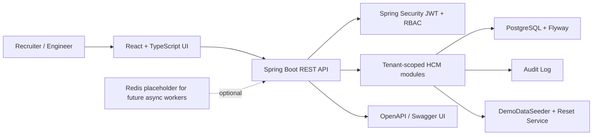

# Enterprise Workforce Management / HCM Platform

Full-stack workforce management platform built with Java Spring Boot and React. It is designed to feel like an enterprise HCM product. With features: role-based dashboards, tenant-scoped data, scheduling warnings, leave management, timesheet approvals, payroll preview explanations, CSV import/export workflows, simulated webhook history, filterable audit logs, and safe-seeded demo reset behaviour.

## Demo Accounts

All demo accounts use:

```text
Password: DemoPass123!
```

| Role | Email | What to Review |
|---|---|---|
| HR Admin | `hr@demo.hcm.local` | Employees, leave balances/accruals, CSV import quality, audit |
| Manager | `manager@demo.hcm.local` | Schedule publishing, pending timesheets, change requests, leave approvals |
| Employee | `employee@demo.hcm.local` | Clock in/out, breaks, manual entries, assigned shifts, leave requests |
| Payroll Admin | `payroll@demo.hcm.local` | Gross-pay previews, explanation reports, locked periods, timesheet exports |
| System Admin | `admin@demo.hcm.local` | Tenant health, audit, `Reset Demo Data` |

The login screen includes quick-fill buttons for every role.

##  Walkthrough

1. Log in as `manager@demo.hcm.local`.
2. Open the Scheduling tab, review the draft week, and resolve the blocking overlap or approved-leave conflict.
3. Optionally assign the open shift to Amara Singh, validate the week, and publish when high-severity blockers are gone.
4. Open Timesheets, review pending submissions and the change-requested week, then approve or reject from the detail panel.
5. Open Leave as the manager, approve or reject the pending vacation/sick requests, and notice Jordan's schedule-conflict warning.
6. Log in as `employee@demo.hcm.local`, open Timesheets, clock out from the active punch, add a manual entry if desired, and submit the current week when validation is clean.
7. Open Leave as the employee, review vacation/sick balances, and submit a vacation, sick, or unpaid request.
8. Log in as `hr@demo.hcm.local` or `admin@demo.hcm.local`, open Leave, run the monthly accrual demo, and inspect balance changes.
9. Log in as `payroll@demo.hcm.local` or `admin@demo.hcm.local`, inspect an approved timesheet, lock or unlock the pay period, then open Payroll and generate a gross-pay preview for the previous week.
10. Review the payroll report lines for hourly rates, regular/overtime split, unpaid break deductions, worked-holiday premium, approved unpaid leave exclusion, and plain-English explanations.
11. Open Integrations as `hr@demo.hcm.local` or `admin@demo.hcm.local`, preview the sample employee CSV, review row-level validation errors, download the error report, and commit the valid rows.
12. Open Integrations as `payroll@demo.hcm.local` or `admin@demo.hcm.local`, export approved timesheets as CSV and JSON.
13. Review webhook event history for `employee.updated`, `timesheet.approved`, and `payroll.preview.generated`, inspect a payload, and redeliver a failed simulated event.
14. Open Audit as HR, payroll, or system admin; filter by actor/action/entity and inspect metadata for schedule, time, leave, payroll, imports, webhooks, and reset events.
15. Optionally log in as `admin@demo.hcm.local` and click `Reset Demo Data`.

## Key Features

- JWT authentication with Spring Security and role-based access control.
- Shared-database multi-tenancy using tenant-scoped rows and JWT tenant claims.
- Seeded demo tenant: `Northstar Retail Group`.
- Employee, department, location, job title, manager relationship, employment status, and soft deactivation model.
- Weekly manager scheduling editor with draft/published weeks, shift creation/editing, open shifts, validation, publishing, and generated schedule alerts.
- Punch-based time tracking with clock in/out, break tracking, manual entries, missed-punch detection, schedule-based late/early warnings, weekly submission, manager approval/rejection, locked pay period flags, change requests, and audit history.
- Simplified gross-pay preview engine with tenant/location pay rules, employee hourly rates, regular/overtime split, unpaid break deductions, worked-holiday premiums, approved unpaid leave callouts, employee-level report lines, and explanation output.
- Leave/absence management with vacation, sick, and unpaid requests, balance reservation/usage, monthly accrual rules, manager decisions, schedule-conflict warnings, calendar/list UI, and approved unpaid leave feeding payroll preview.
- Integration Center with employee CSV field mapping, preview/commit import workflow, per-row validation errors, downloadable error reports, approved-timesheet CSV/JSON exports, and simulated webhook delivery history.
- Filterable audit browser for employee updates, schedule publication, timesheet approval, payroll preview generation, imports, webhook events, reset safety, and demo seeding.
- Hidden private `/analytics` owner page for first-party usage stats such as visits, anonymous unique visitors, last used time, active-now estimate, role login counts, top pages, and recent activity.
- System Admin-only visible `Reset Demo Data` button.
- Docker Compose with service healthchecks, Flyway migrations, Swagger/OpenAPI, Actuator health, CI, and tests.

## Architecture



## Tech Stack

Backend:

- Java 17
- Spring Boot 3
- Spring Security
- Spring Data JPA / Hibernate
- PostgreSQL
- Flyway
- springdoc OpenAPI / Swagger
- JUnit, AssertJ, Mockito-ready Spring test stack, Testcontainers dependencies

Frontend:

- React
- TypeScript
- Vite
- MUI
- TanStack Query
- React Hook Form
- Zod
- Vitest and Testing Library

DevOps:

- Docker Compose
- GitHub Actions CI
- Environment variable examples
- Health endpoint at `/actuator/health`

## Local Setup

Prerequisites:

- Java 17
- Maven 3.9+
- Node 24+
- Docker Desktop

From the repo root:

```bash
docker compose up --build
```

Then open:

- Frontend: `http://localhost:3000`
- Backend health: `http://localhost:8080/actuator/health`
- Swagger UI: `http://localhost:8080/swagger-ui.html`

For separate dev servers:

```bash
docker compose up -d postgres redis
cd backend
mvn spring-boot:run
```

In another terminal:

```bash
cd frontend
npm install
npm run dev
```

Open `http://localhost:5173`.

On Windows PowerShell, use `npm.cmd` if script execution policy blocks `npm.ps1`.

## Environment Variables

See `.env.example`.

Important variables:

- `SPRING_DATASOURCE_URL`
- `SPRING_DATASOURCE_USERNAME`
- `SPRING_DATASOURCE_PASSWORD`
- `APP_JWT_SECRET`
- `APP_SEED_DEMO`
- `APP_DEMO_RESET_SECRET`
- `APP_ANALYTICS_OWNER_KEY`
- `APP_ANALYTICS_ENABLED`
- `APP_CORS_ALLOWED_ORIGINS`
- `VITE_API_BASE_URL`

## API Docs

After starting the backend:

- Swagger UI: `http://localhost:8080/swagger-ui.html`
- OpenAPI JSON: `http://localhost:8080/v3/api-docs`

Important API groups:

- `/api/v1/auth`
- `/api/v1/dashboard`
- `/api/v1/employees`
- `/api/v1/schedules/alerts`
- `/api/v1/schedules/weeks`
- `/api/v1/time`
- `/api/v1/timesheets`
- `/api/v1/payroll/previews`
- `/api/v1/leave/requests`
- `/api/v1/leave/balances`
- `/api/v1/leave/calendar`
- `/api/v1/leave/accruals/run`
- `/api/v1/integrations`
- `/api/v1/audit-logs?from=&to=&actorEmail=&actionType=&entityType=&entityId=&limit=`
- `/api/v1/demo/reset`

## Business Rules Implemented

- Employee and user access is scoped to the authenticated tenant.
- Demo accounts are protected from destructive account operations.
- Demo tenant data can be reset without affecting non-demo tenants.
- Schedule validation detects invalid shifts, overlapping shifts, approved-leave conflicts, open shifts, minimum-rest violations, and weekly hour-cap warnings.
- Part-time employees can have lower weekly hour caps.
- Timesheet validation flags locked periods, missed punches, invalid clock ranges, overlapping entries, invalid breaks, active breaks, and schedule-based late/early warnings.
- Approved timesheets require a manager/payroll reopen decision through change requests before employee edits; locked periods can only be unlocked by payroll/system administrators.
- Paid leave requests reserve available vacation/sick balance while pending, move reserved hours to used hours on approval, and release reservations on rejection; unpaid leave skips balances but still appears in payroll preview once approved.
- Leave accruals are tenant-level monthly demo rules, apply once per employee/type/month, respect max balances, and write balance/audit events.
- Leave schedule conflicts warn managers when assigned shifts exist in the requested date range, but they do not block approval.
- Payroll previews use submitted/approved timesheets only, recalculate pay from complete time entries and unpaid breaks, apply location pay rules, add worked-holiday premium, report approved unpaid leave as non-payable, persist employee calculation lines, and emit plain-English explanations.
- CSV import validation checks required fields, duplicate employee IDs, existing employee number/email conflicts, invalid manager emails, invalid departments/locations/job titles, invalid pay rates, invalid weekly caps, invalid employment statuses/types, and invalid hire dates.
- Employee imports use a preview/commit flow, commit valid rows only, keep invalid row errors visible, and expose a downloadable error report.
- Integration exports include approved tenant-scoped timesheets only in matching CSV and JSON formats.
- Simulated webhooks persist recruiter-readable payloads and delivery attempts for `employee.updated`, `timesheet.approved`, and `payroll.preview.generated`, with redelivery creating a new attempt.
- Audit log browsing is tenant-scoped and supports date, actor, action, entity, entity id, and limit filters.
- Sensitive workflow events create audit records.

## Testing

Backend:

```bash
cd backend
mvn test
```

Optional Docker-backed integration smoke tests:

```bash
cd backend
mvn -Pintegration-tests verify
```

The Testcontainers profile runs when Docker is available and skips the container smoke test gracefully when it is not.

Frontend:

```bash
cd frontend
npm install
npm run typecheck
npm run build
npm test
```

Current focused tests cover:

- Schedule conflict, open-shift, leave-conflict, and publish rules
- Leave request balance reservation, insufficient-balance rejection, unpaid leave, approval/rejection balance transitions, monthly accrual caps, API security annotations, and conflict warnings
- Payroll preview calculations, location rules, employee line persistence, API generation, blocking invalid punches, audit logging, and explanation text
- Time tracking validation, weekly rollups, approval/rejection, change requests, locks, and API role rules
- CSV import parsing, mapping, validation, commit behavior, and API security
- Approved-timesheet CSV/JSON export behavior
- Webhook event persistence, delivery attempts, redelivery, and API security
- Audit log filtering, tenant scoping, role permission contracts, and demo reset safety
- Login page seeded-account quick-fill behavior

## Deployment And Screenshots

- Deployment notes: [docs/DEPLOYMENT.md](docs/DEPLOYMENT.md)
- Demo reset safety: [docs/DEMO_RESET.md](docs/DEMO_RESET.md)
- Screenshot capture checklist: [docs/screenshots/README.md](docs/screenshots/README.md)

## Demo Data Reset

The backend seeds `Northstar Retail Group` when `APP_SEED_DEMO=true`.

System Admin can reset demo state from the UI:

1. Log in as `admin@demo.hcm.local`.
2. Click `Reset Demo Data`.
3. Confirm the reset.

The reset is scoped to the demo tenant only.

## Project Roadmap

Implemented foundation:

- Monorepo scaffold
- Spring Boot API
- React UI
- JWT auth
- RBAC dashboards
- Tenant-aware data model
- Seeded demo workflows
- Employee/org APIs
- Weekly schedule editor, validation, publish, and alert APIs
- Punch clock, manual time entry, break tracking, timesheet approval, change request, and lock APIs
- Payroll preview summary/detail/generation APIs backed by seeded tenant/location rules and holidays
- Leave request, balance, accrual, calendar, and audit APIs
- Integration Center APIs for employee CSV import preview/commit/error reports, approved timesheet CSV/JSON exports, and simulated webhook history/redelivery
- Filterable audit API and Audit tab browser
- Docker healthchecks, frontend test CI, Compose validation, and gated Testcontainers smoke tests
- Demo reset endpoint and UI
- Docker/CI/docs/tests

